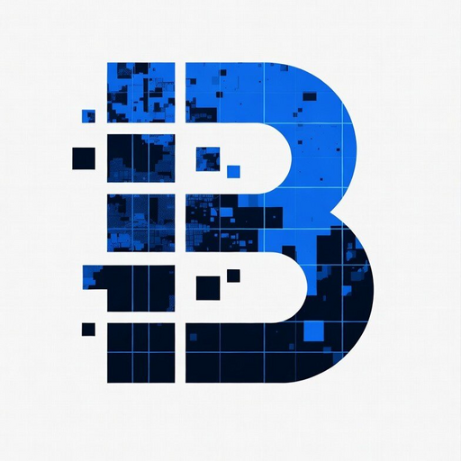

<div align="center">
  <picture>
    <source media="(prefers-color-scheme: dark)" srcset="public/icon-v2-512.png">
    
  </picture>

  # BASEBOARD

  ### 9,998,244 Pixels. One Canvas. Base Chain.

  [](https://basescan.org/address/0x74a866b547d106c59ab80A842A6442B2506F25fA)
  [](contracts/BaseBoard.sol)
  [](https://nextjs.org)
  [](tsconfig.json)
  [](LICENSE)
  [](https://baseboard-seven.vercel.app)

  **[baseboard-seven.vercel.app](https://baseboard-seven.vercel.app)**
</div>

---

## The Grid

```
┌──────────────────────────────────────────┐
│                                          │
│  ┌──┬──┬──┬──┬──┬──┬──┐                │
│  │  │  │  │  │  │  │  │                │
│  ├──┼──┼──┼──┼──┼──┼──┤                │
│  │  │  │  │  │  │  │  │                │
│  ├──┼──┼──┼──┼──┼──┼──┤                │
│  │  │  │██│██│██│  │  │                │
│  ├──┼──┼──┼──┼──┼──┼──┤                │
│  │  │  │██│██│██│  │  │                │
│  ├──┼──┼──┼──┼──┼──┼──┤                │
│  │  │  │██│██│██│  │  │                │
│  ├──┼──┼──┼──┼──┼──┼──┤                │
│  │  │  │  │  │  │  │  │                │
│  ├──┼──┼──┼──┼──┼──┼──┤                │
│  │  │  │  │  │  │  │  │                │
│  └──┴──┴──┴──┴──┴──┴──┘                │
│                                          │
└──────────────────────────────────────────┘

        3,162 × 3,162 = 9,998,244
```

**3,162 × 3,162** individually addressable plots.
Every plot has an owner, a price, and an image URI — stored on **Base Mainnet**.

---

## What is BaseBoard?

BaseBoard is a permanent on-chain canvas on **Base**. Buy unminted pixels at a flat price, embed images and links into them, and build your presence on the chain that's defining the next era of crypto.

It's part billboard, part art canvas, part social layer — all on-chain.
No metadata server. No IPFS gatekeeper. Just a **Solidity smart contract** and a **high-performance renderer** that draws every pixel in real-time.

---

## What Can You Do?

| | |
|---|---|
| 🎨 **Buy Pixels** | 0.00005 ETH each. Any number in one transaction. |
| 🖼️ **Embed Images** | Attach any image URI (IPFS, HTTP, Arweave). Rendered live on the board. |
| 🔗 **Attach Links** | Each pixel can carry a clickable link — your project, your art, your message. |
| 🏪 **Sell Plots** | List them at any price. Collect ETH directly. |
| 💰 **Make Offers** | Bid on any owned plot. No permission needed. |
| 📐 **Billboard Mode** | Buy adjacent plots, attach one image — it stretches across all of them. |
| 🔍 **Real-time** | New purchases appear instantly via contract event watchers. |
| 🌡️ **Heatmap** | Toggle a purchase-density overlay to see where the community is most active. |

---

## Architecture

```
                   ┌──────────────────────────────┐
                   │      Base Mainnet (8453)      │
                   │  ┌────────────────────────┐   │
                   │  │    BaseBoard.sol       │   │
                   │  │  · buyPlots()          │   │
                   │  │  · listPlot()          │   │
         read     │  │  · placeOffer()        │   │  events
   ◄──────────────│  │  · updatePlotImage()   │──────────────►
                   │  └────────────────────────┘   │
                   └──────────────────────────────┘
                           ▲         │
                           │         │ logs
                           │         ▼
         ┌───────────────────────────────────────┐
         │           Next.js 15 App              │
         │                                       │
         │  ┌──────────┐  ┌──────────────────┐  │
         │  │ Wagmi /  │  │  HTML5 Canvas     │  │
         │  │ Viem     │  │  (offscreen       │  │
         │  │ Onchain  │  │   compositing)    │  │
         │  │ Kit      │  └──────────────────┘  │
         │  └──────────┘                        │
         │         │                            │
         │         ▼                            │
         │  ┌──────────────────┐                │
         │  │ Turso (libSQL)   │                │
         │  │ · plot index     │                │
         │  │ · fast read      │                │
         │  └──────────────────┘                │
         └───────────────────────────────────────┘
```

### The Contract

`BaseBoard.sol` is a minimal, non-upgradable Solidity contract:

| Feature | Function |
|---|---|
| **Buy plots** | `buyPlots(uint256[] calldata plotIds)` — 0.00005 ETH each, 100% to treasury |
| **List for sale** | `listPlot(uint256 plotId, uint256 price)` — secondary market |
| **Buy listed** | `buyListedPlot(uint256 plotId)` — instant purchase from seller |
| **Offers** | `placeOffer` / `acceptOffer` / `cancelOffer` — escrowed bidding |
| **Images** | `updatePlotImage(uint256 plotId, string calldata imageUri)` — supports `#bb=x1,y1,x2,y2` zones |
| **Batch reads** | `getPlotsBatch(uint256[] calldata plotIds)` — bulk view calls |

**Storage:** Sparse `mapping(uint256 => Plot)` — no iteration over 10M ids.
**Coordinates:** `plotId = (y × 3162) + x`

---

## Tech Stack

| Layer | Tech |
|---|---|
| Framework | Next.js 15 (App Router) |
| Language | TypeScript 5, Solidity ^0.8.24 |
| Blockchain | Wagmi 2.x, Viem 2.x |
| Wallet | Coinbase OnchainKit, WalletConnect |
| Database | Turso (libSQL) |
| State | Zustand |
| Styling | Tailwind CSS 4 |
| Contract Dev | Hardhat + Hardhat Toolbox |
| Canvas | HTML5 Canvas (offscreen compositing, LOD cache, LRU eviction) |

---

## Getting Started

```bash
git clone https://github.com/omiaydin1/baseboard.git
cd baseboard
npm install
cp .env.example .env.local
npm run dev
```

Open [http://localhost:3000](http://localhost:3000).

---

## Scripts

| Command | What it does |
|---|---|
| `npm run dev` | Next.js dev server |
| `npm run build` | Production build |
| `npm run lint` | ESLint |
| `npm run typecheck` | `tsc --noEmit` |
| `npm run compile` | Compile Solidity (Hardhat) |
| `npm run deploy` | Deploy to Base |

---

## Public Deploy

| | |
|---|---|
| **Chain** | Base Mainnet (chain ID: 8453) |
| **Contract** | [`0x74a866b547d106c59ab80A842A6442B2506F25fA`](https://basescan.org/address/0x74a866b547d106c59ab80A842A6442B2506F25fA) |
| **Deploy Block** | 47,083,347 |
| **Grid** | 3,162 × 3,162 = 9,998,244 plots |
| **Plot Price** | 0.00005 ETH (flat) |
| **Treasury** | `0xce83...f1e2` |
| **App** | [baseboard-seven.vercel.app](https://baseboard-seven.vercel.app) |

---

## License

MIT

---

<div align="center">
  <sub>
    BaseBoard · On-chain since block 47,083,347 ·
    <a href="https://baseboard-seven.vercel.app">baseboard-seven.vercel.app</a>
  </sub>
  <br>
  <sub>
    <a href="https://github.com/omiaydin1/baseboard">GitHub</a> ·
    <a href="https://basescan.org/address/0x74a866b547d106c59ab80A842A6442B2506F25fA">BaseScan</a>
  </sub>
</div>
